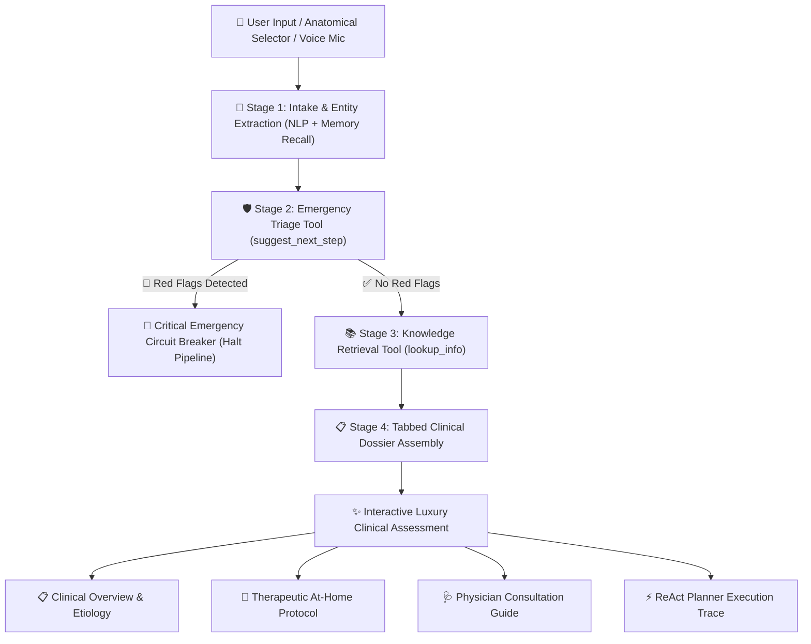

# 🩺 MedAssist — Concierge Symptom Intelligence & Clinical Triage Engine

[](https://sathvik1696.github.io/medassist-symptom-helper/)
[](https://github.com/Sathvik1696/medassist-symptom-helper)
[](https://github.com/Sathvik1696/medassist-symptom-helper)
[-3B82F6?style=for-the-badge)](https://github.com)
[](LICENSE)

> **MedAssist** is an **Agentic Clinical Decision Support (ReAct Agent) Platform** styled with an **Obsidian & Champagne Gold Quiet Luxury aesthetic**. It provides deterministic, safety-first symptom triage, interactive anatomical body zone navigation, real-time biometric risk indexing, audio briefing synthesis, and tabbed clinical dossiers.

---

## 🌟 What Is MedAssist? (Agent vs Generic LLM Chatbot)

MedAssist is an **Agentic Symptom Intelligence Engine**, not a generic conversational chatbot:

| Dimension | Generic LLM Chatbot | MedAssist ReAct Agent |
|---|---|---|
| **Emergency Triage** | Prone to hallucinations & delayed warnings | **100% Deterministic Safety Circuit Breaker** (`suggest_next_step`) |
| **Fact Grounding** | May fabricate unverified home remedies | **Grounded Evidence-Based Knowledge Base** (`lookup_info`) |
| **Execution Loop** | Black-box single-turn text stream | **Explicit 4-Stage ReAct Trace** (Thought ➔ Action ➔ Observation ➔ Dossier) |
| **Session Memory** | Often forgets earlier symptoms across turns | **Continuous Session Memory Buffer** folding past & present clinical entities |
| **User Experience** | Monolithic text walls | **Interactive Anatomical Console + Tabbed Clinical Dossiers** |
| **Infrastructure** | Requires expensive backend API tokens | **100% Client-Side Portable** (Zero Dependencies, Zero API cost) |

---

## 🏛️ System Architecture



---

## ✨ Features & Capabilities

### 1. 🫀 Interactive Anatomical Body System Explorer
- **8 Anatomical Zones**: Cranial & Neuro, Cardiopulmonary, Respiratory, Gastrointestinal, Musculoskeletal, Dermatology, ENT & Sinus, Systemic & Vitals.
- **Symptom Capsule Vault**: Select any anatomical zone to reveal clickable symptom capsules that stage directly into your clinical intake portfolio.

### 2. ⚡ Biometric Matrix & Real-Time Risk Gauge
- **Severity Dial**: Mild, Moderate, Severe, Critical with dynamic visual bloom.
- **Onset / Duration Matrix**: `< 24 Hours`, `1–3 Days`, `1–2 Weeks`, `Chronic (> 1 mo)`.
- **Patient Profile Toggles**: Adult, Senior (65+), Pediatric, Asthma, Hypertension, Diabetes, Pregnancy.
- **Dynamic Risk Gauge**: Recalculates baseline clinical risk in real time as parameters change.

### 3. 📑 Tabbed Luxury Clinical Dossier
Every consultation response is compiled into a structured clinical document:
- **Intake Matrix Banner**: Case ID, reported symptoms, duration, severity, and triage risk level.
- **Tab 1 — Clinical Etiology**: Documented physiological context and clinical associations.
- **Tab 2 — At-Home Protocol**: Safe, evidence-based non-pharmacological self-care guidelines.
- **Tab 3 — Physician Guide**: Questions to ask your doctor and clinical escalation criteria.
- **Tab 4 — ReAct Execution Trace**: Inspect the planner's thoughts, tool calls, and observations.
- **Dossier Actions**:
  - `📋 Copy Summary`: Copies formatted doctor summary to clipboard.
  - `🖨️ Export Dossier`: Opens a print-ready consultation preview.
  - `🔊 Listen / Stop Audio`: Synthesizes voice briefings with real-time play/stop toggle.

### 4. 🎙️ Voice Input Concierge & Acoustic Haptics
- **Web Speech Recognition**: Effortless spoken symptom dictation via the microphone button.
- **Web Audio Synthetic Chimes**: Soft gold acoustic feedback for clicks, staging, and completion.

### 5. 🧠 Session Memory Buffer Inspector
- Stateful memory drawer tracking all symptoms mentioned across conversation turns in the session with 1-click buffer clear.

---

## 🚀 Live Deployment Guide

MedAssist is 100% static (pure HTML5, CSS3, ES Modules) and can be deployed in 30 seconds for free:

### Option A: Deploy to Vercel (Recommended)

1. Fork or push this repository to your GitHub account.
2. Go to [vercel.com/new](https://vercel.com/new).
3. Import your GitHub repository.
4. Click **Deploy** (zero configuration required — `vercel.json` is included).

Or via Vercel CLI:
```bash
npm i -g vercel
vercel
```

### Option B: Deploy to GitHub Pages

1. Push this repository to GitHub.
2. In your repository, navigate to **Settings ➔ Pages**.
3. Under **Source**, select `Deploy from a branch` and set Branch to `main` / `root`.
4. Click **Save** — your site will be live at `https://<username>.github.io/<repo-name>/`.

### Option C: Run Locally

```bash
# Clone the repository
git clone https://github.com/<your-username>/medassist.git
cd medassist

# Start any local HTTP server (ES Modules require HTTP/HTTPS)
py -3 -m http.server 3000
# or: npx serve
```
Open **`http://localhost:3000`** in your browser.

---

## 📂 Project Structure

```text
├── index.html            # Luxury semantic HTML5 shell
├── vercel.json           # Zero-config Vercel static deployment config
├── css/
│   └── styles.css        # Quiet luxury design system (Obsidian, Gold, Emerald)
└── js/
    ├── app.js            # Main controller, anatomical studio, audio & memory
    ├── pipeline.js       # 4-stage ReAct orchestrator with memory recall
    ├── tools.js          # ReAct tools: suggest_next_step & lookup_info
    ├── triage.js         # Emergency red flag evaluation engine (7 categories)
    ├── knowledge.js      # Evidence-based medical knowledge base (20+ clusters)
    └── renderer.js       # Tabbed Clinical Dossier HTML renderer
```

---

## 📄 License & Disclaimer

- **License**: [MIT](LICENSE)
- **Medical Disclaimer**: MedAssist is an educational decision-support reference engine designed for informative purposes. It does not constitute medical diagnosis or treatment plans. Users should always consult qualified healthcare providers for medical advice.
